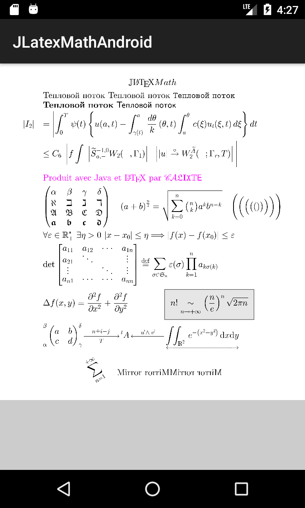
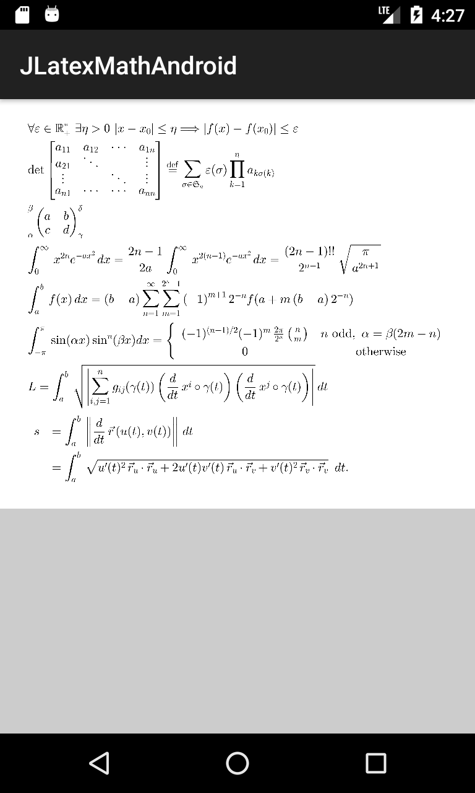

# JLatexMath Android

This is a fork of [jlatextmath](https://github.com/opencollab/jlatexmath) project that brings rendering of LaTeX math to Android. Fork tries to keep as close as possible to the parent project by _mimicking_ `java.awt.*` package classes. 

## Installation

[](http://search.maven.org/#search|ga|1|g%3A%22ru.noties%22%20AND%20a%3A%22jlatexmath-android%22)
[](http://search.maven.org/#search|ga|1|g%3A%22ru.noties%22%20AND%20a%3A%22jlatexmath-android-font-cyrillic%22)
[](http://search.maven.org/#search|ga|1|g%3A%22ru.noties%22%20AND%20a%3A%22jlatexmath-android-font-greek%22)

```gradle
implementation 'ru.noties:jlatexmath-android:${version}'

// for Cyrillic symbols
implementation 'ru.noties:jlatexmath-android-font-cyrillic:${version}'

// for Greek symbols 
implementation 'ru.noties:jlatexmath-android-font-greek:${version}'
```

## Screenshots
 

Other screenshots can be found `./app/screenshots` folder

## Usage

```java
final JLatexMathDrawable drawable = JLatexMathDrawable.builder(latex)
        .textSize(70)
        .padding(8)
        .background(0xFFffffff)
        .align(JLatexMathDrawable.ALIGN_RIGHT)
        .build();
```

```xml
<ru.noties.jlatexmath.JLatexMathView
    android:id="@+id/j_latex_math_view"
    android:layout_width="match_parent"
    android:layout_height="wrap_content"
    android:padding="16dip"
    android:background="@color/white"
    app:jlmv_alignVertical="center"
    app:jlmv_alignHorizontal="center"
    app:jlmv_textSize="16sp" />
```


## Licence
GNU GENERAL PUBLIC LICENSE Version 2, June 1991